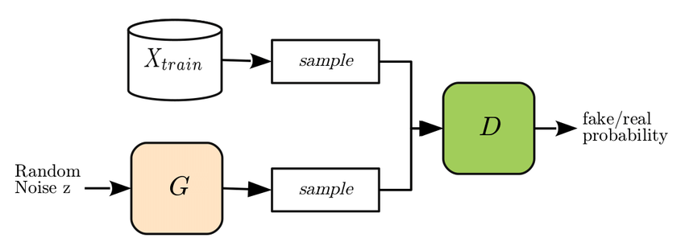
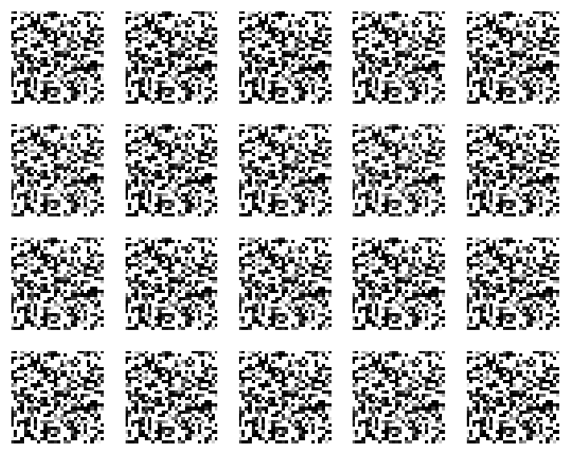
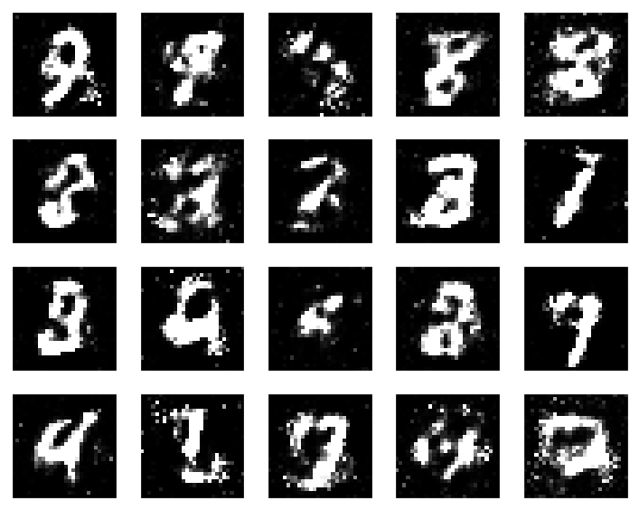
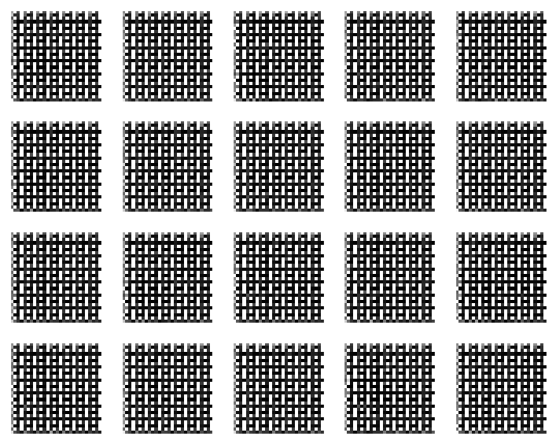
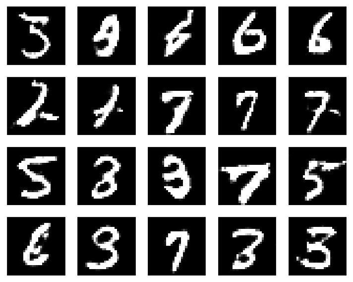
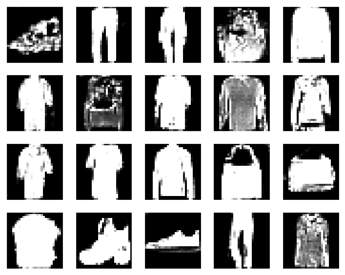
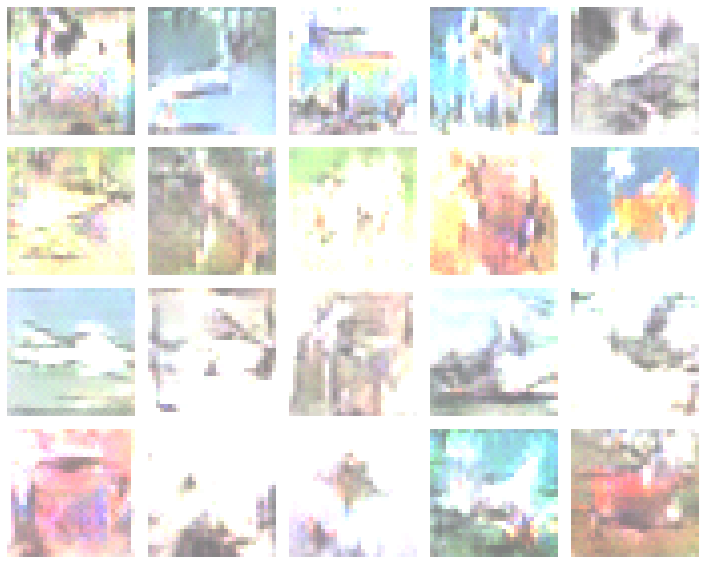

# Generative Adversarial Networks for 2-D Image Sets

## Introduction
This repository contains the work from my winter project that specifically involves generative adversarial networks for 2-D images. A more thorough description of my project at large can be found on my portfolio [site](https://jomian78.github.io/Portfolio/). My ongoing work with GANs for 3-D point clouds can be found [here](https://github.com/jomian78/3d_point_cloud_gan).

## Background on GANs
The basic idea behind a generative adversarial network is to pit two different machine learning models against each other in a min-max game. Both networks - one called a "generator" and one called a "discriminator", attempt to minimize their loss functions at the behest of the other model. The goal of the generator is to create data that matches the variation and distribution of some target data set. In theory, this synthetic data could be used to train other models with the same level of success as "real" data if it truly matches a target data set's variety and distribution. On the other hand, the goal of the discriminator is to be able to discern "real" data from "fake" data created by the generator.

The ideal training outcome is to have both models reach a sort of Nash equilibrium with each other. If the discriminator becomes too good at discerning real data from fake data early on in the training process, then your generator may not be able to create progressively more "realistic" data with each training run. On the other hand, your generator can overpower your discriminator by creating garbage data that does not resemble the target data set, but that still fools your discriminator.

A basic block diagram of a GAN structure can be seen below:

#### Block diagram - from reference [2]

The generator model takes in a random sample of noise as its input and then outputs a set of generated data. For each run of training, a sample of this "fake" data is
combined with a sample of "real" data from the target data set. Training labels are assigned to both real and fake data before the combined batch is sent to the discriminator network. The discriminator takes in the combined batch as its input and then outputs a probability distribution of whether each image is real or fake. The resulting probability distribution is then used to update the weights of both the generator and discriminator networks.

## Initial implementation on MNIST

I used Naoki Shibuya's [guide](https://github.com/naokishibuya/deep-learning/blob/master/python/gan_mnist.ipynb) as a starting point for getting a GAN up and running with the MNIST dataset. I also decided to use the [Keras](https://keras.io/) library for quick and easy prototyping.

The first version of my network was simple, with the generator and discriminator models each containing only a single convolution layer. No processing tricks were used, and as a result the initial training runs were unsuccessful, despite various attempts at parameter tuning.

#### Output from initial training:

Further research led me to implement some basic tricks for training and stabilizing GAN's from Soumith Chintala's [GAN hacks](https://github.com/soumith/ganhacks) page. The tricks I used were:
1. Flipping the labels on the "real" and "fake" data fed to the discriminator
    - labels during my first attempt were 0 = "fake", 1 = "real"

2. Softening the labels by adding a small amount of noise to them
    - giving the real labels values from a uniform distribution of [0.0-0.1] and fake labels values from a uniform distribution of [0.9-1.0]

3. Using the Adam optimizer for updating network weights instead of standard stochastic gradient descent

4. Creating my noise input (aka "latent sample") to the generator model via a uniform distribution
    - values were from [-1,1], size of 100 samples

5. Using the Leaky ReLU activation function instead of the regular ReLU

While the results of incorporating these tricks into my basic network were promising, some of the resulting images were blurry and had dubious output.

#### Output with incorporation of training tricks:

## DCGAN implementation
I decided to implement a DCGAN (Deep Convolutional GAN) for the MNIST dataset to get even better training results. DCGANs are deeper networks that eliminate fully connected layers and max pooling in favor of 2D transpose convolutions and convolutional strides. Attempts involving 5 or more convolutional layers for both the discriminator and generator model resulted in a sort of "tiled" output that is characteristic of using the wrong kernel size for convolution strides or using the wrong dimensions for each layer.

#### Erroneous tiled results

Simplifying both models in the DCGAN to have two convolutional layers led to sharper, more realistic output as did tuning the Adam optimizer's momentum parameter.

#### DCGAN output with simplified model structure

## Further extensions
In the final weeks of the quarter, I tested my DCGAN on different data sets, which included the MNIST fashion data set, as well as the CIFAR-10 dataset. These tests required minimal modification, mainly reshaping individual layers to accomodate different images sizes as well as 3-channels for colored images.

The results of both can be seen below.

#### DCGAN output for MNIST fashion

#### DCGAN output for CIFAR-10

## Conclusions
The output for both the MNIST fashion and CIFAR-10 datasets still needs work. Using a deeper network with better hyper-parameter tuning or perhaps a different architecture altogether could yield better results. Both outputs have some resemblance to the actual appearance of both of their respective data sets but there are clearly issues with sharpness, as well as the brightness level with the CIFAR-10 data set. Further experimentation will be needed and I look forward to continuing to work on these problems as well as experiment with other 2-D image sets. 

## References
[1] https://arxiv.org/abs/1707.02392 - paper on point cloud shape modification (Panos Achlioptas)

[2] https://arxiv.org/pdf/1705.07663.pdf - paper on membership inference attacks against Generative Models

[3] https://github.com/naokishibuya/deep-learning/blob/master/python/gan_mnist.ipynb - great overview of basic GANS from Naoki Shibuya (Ascent Robotics)

[4] https://blog.paperspace.com/implementing-gans-in-tensorflow/ - tutorial on building a linear gan from Aadil Hayat (IIT)

[5] https://arxiv.org/pdf/1511.06434.pdf - Introductory paper on DCGANS

[6] https://arxiv.org/pdf/1406.2661.pdf - original GAN paper from Ian Goodfellow

[7] https://github.com/soumith/ganhacks - Tips for training GAN's from Soumith Chintala (Facebook AI Research)
